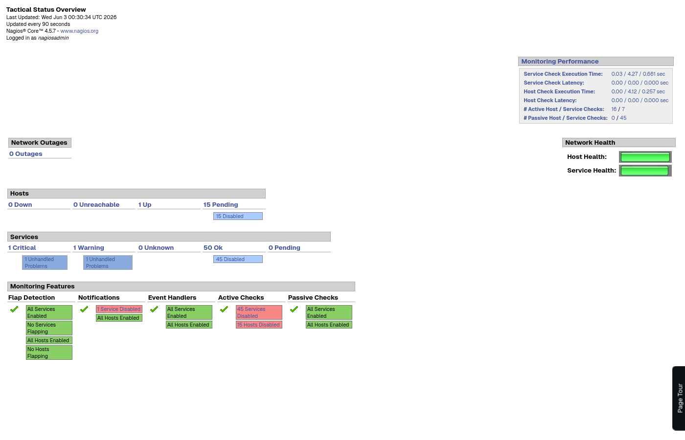
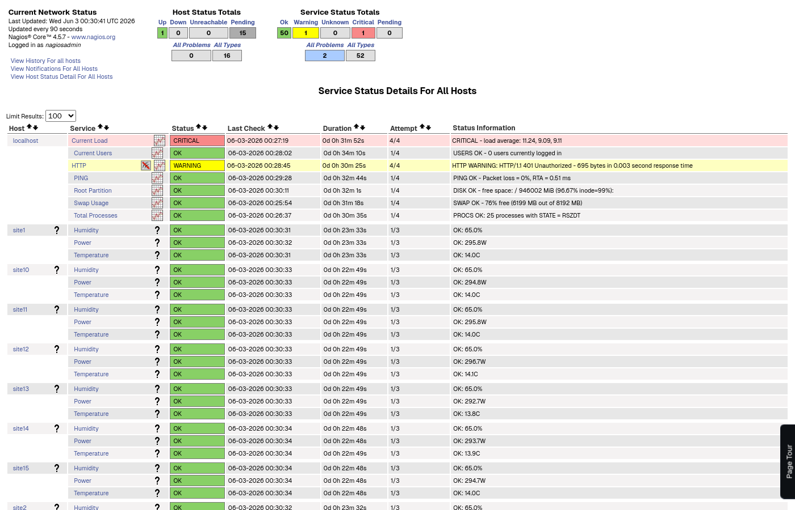
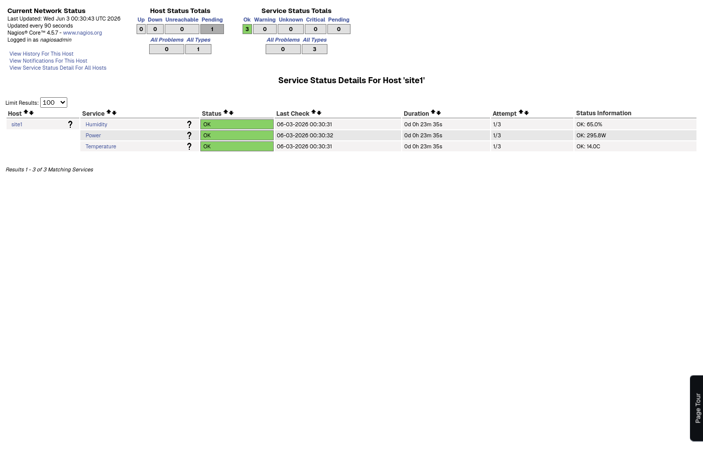
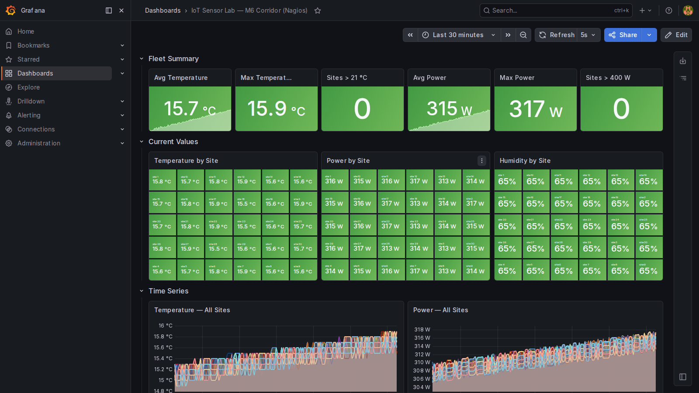
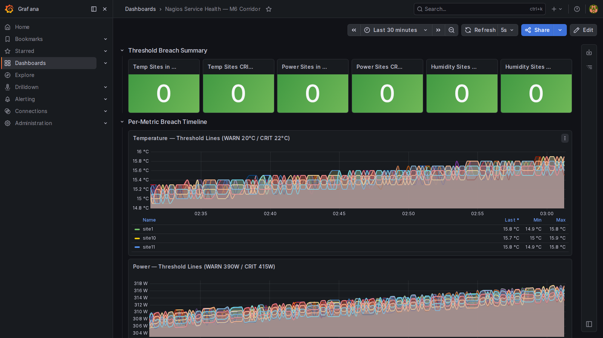
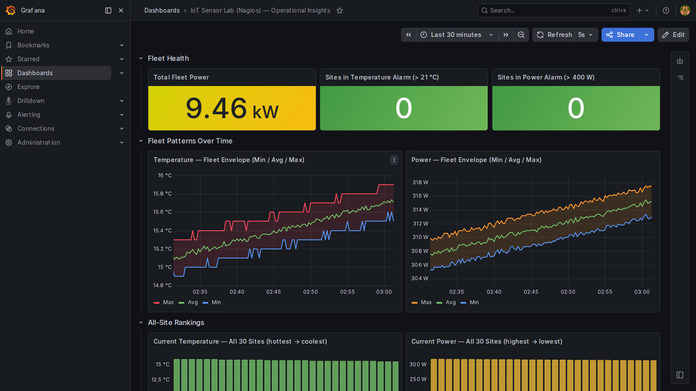

# Nagios MQTT Monitoring Lab

A fully containerised MQTT IoT monitoring lab combining **Eclipse Mosquitto**, **Nagios Core 4.5**, and a Python **sidecar** to simulate 15 IoT sensor sites along the M6 corridor, auto-provision Nagios hosts and services, and visualise telemetry via passive check results.

Mirrors the design and MQTT topology of the [mqtt2](https://github.com/mmorrow24work/mqtt2) Zabbix lab — same broker config, same publisher script, same sidecar pattern — with Nagios as the monitoring backend instead of Zabbix.

---

## Architecture

```
┌─────────────────────────────────────────────────────────────────┐
│                       Docker Compose Stack                      │
│                                                                 │
│  publisher  (Alpine — publisher.sh)                             │
│  Publishes every 10s:                                           │
│    lab/temp/site{1-15}       lab/humidity/site{1-15}            │
│    lab/power/site{1-15}      lab/location/site{1-15}            │
│    lab/discovery  (retained JSON)                               │
│                      │                                          │
│              ┌───────▼────────────┐                             │
│              │  mqtt-broker       │  Eclipse Mosquitto :1883    │
│              └─────────┬──────────┘                             │
│                        │                                        │
│              ┌─────────▼──────────┐                             │
│              │  nagios-sidecar    │  Python                     │
│              │  • Creates .cfg    │  Subscribes to lab/#        │
│              │    per site        │  Writes passive results      │
│              │  • Sends SIGHUP    │  via Nagios cmd pipe        │
│              └─────────┬──────────┘                             │
│                        │  conf.d/ + nagios.cmd                  │
│              ┌─────────▼──────────┐                             │
│              │  nagios            │  Nagios Core :80            │
│              │  (jasonrivers)     │  45 passive services        │
│              └────────────────────┘                             │
└─────────────────────────────────────────────────────────────────┘
```

---

## Nagios Dashboards

### Tactical Overview

The tactical overview shows host and service health at a glance. All 15 MQTT sensor sites register as passive-only hosts.



> 50 OK services (45 MQTT + 5 localhost), Passive Checks enabled for all site services, Network Health green.

### All Services

The service detail view lists all sites with their three metrics — Temperature, Humidity, and Power — updated every 10 seconds from MQTT.



### Per-Site Detail

Each site has its own host page showing current telemetry values from the sensor simulation.



---

## Grafana Dashboards

Three Grafana dashboards are provisioned into the standalone Grafana instance (port 5000) under the `datasource-nagios` Prometheus datasource, which points to the [prometheus-mqtt](https://github.com/mmorrow24work/prometheus-mqtt) Prometheus instance at port 9090.

Run the provisioning script to create or restore them:

```bash
python3 scripts/provision_grafana_dashboards.py
```

> Requires the standalone `grafana` container to be running on port 5000 and connected to the `prometheus-mqtt_monitoring` Docker network. The showcase dashboard also requires the prometheus-mqtt Grafana to be running on port 3000.

### IoT Sensor Lab — M6 Corridor (Nagios)

`http://localhost:5000/d/nagios-iot-sensors/`

Fleet summary stats (avg/max temperature and power, breach counts), current values per site, time-series for all three metrics, and a top-10 power bar chart. Mirrors the main prometheus-mqtt dashboard with the `datasource-nagios` datasource.



### Nagios Service Health — M6 Corridor

`http://localhost:5000/d/nagios-service-health/`

Maps the Nagios passive check thresholds (WARN/CRIT for temp, power, humidity) to Prometheus queries. Shows per-metric breach counts as stat panels and threshold-line time series so you can correlate Grafana alert state with what Nagios would report.

| Metric | WARNING threshold | CRITICAL threshold |
|---|---|---|
| Temperature | ≥ 20°C | ≥ 22°C |
| Humidity | ≥ 75% | ≥ 85% |
| Power | ≥ 390 W | ≥ 415 W |



### IoT Sensor Lab (Nagios) — Operational Insights

`http://localhost:5000/d/nagios-iot-showcase/`

Cloned from the `iot-mqtt-showcase` dashboard in the prometheus-mqtt lab and repointed to `datasource-nagios`. Fetched live from port 3000 at provisioning time so it stays in sync with the source.



---

## Components

| Service | Image | Role |
|---|---|---|
| `mqtt-broker` | `eclipse-mosquitto:2` | MQTT broker on port 1883 (host: 1884) |
| `publisher` | `alpine:3.20` | Simulates 15 IoT sites — temp, humidity, power, location |
| `sidecar` | *(built from `sidecar/`)* | Watches MQTT, auto-creates Nagios host/service configs, submits passive check results |
| `nagios` | *(built from `nagios/`)* | Nagios Core 4.5 with Apache form login (port 8088) |

Container names follow Docker Compose defaults: `nagios-mqtt-<service>-1`.

---

## MQTT Topic Structure

| Topic | Payload | Description |
|---|---|---|
| `lab/temp/site{N}` | `float` | Temperature °C — sinusoidal diurnal cycle, base 17°C ±5 |
| `lab/humidity/site{N}` | `float` | Humidity % — constant 65% |
| `lab/power/site{N}` | `float` | Power W — sinusoidal with 1hr lag behind temp, base 350W ±70 |
| `lab/location/site{N}` | `lat,lon` | GPS coordinates interpolated along M6 corridor |
| `lab/discovery` | JSON (retained) | Site list — `[{"{#SITE}":"site1"},...]` |

---

## Passive Check Thresholds

| Metric | OK | WARNING | CRITICAL |
|---|---|---|---|
| Temperature | < 20°C | 20–22°C | ≥ 22°C |
| Humidity | < 75% | 75–85% | ≥ 85% |
| Power | < 390W | 390–415W | ≥ 415W |

Services use **check freshness** (120s) — if no MQTT message arrives, the service transitions to UNKNOWN automatically.

---

## Sidecar Behaviour

On first message from a new site the sidecar:

1. Writes `nagios/conf.d/site{N}.cfg` with host + 3 service definitions
2. Sends `SIGHUP` to the Nagios process via `docker exec` to reload config
3. Begins submitting `PROCESS_SERVICE_CHECK_RESULT` commands to the Nagios external command pipe for every subsequent metric message

---

## Repository Structure

```
nagios-mqtt/
├── docker-compose.yml          # Full stack — 4 services
├── mosquitto/
│   └── config/
│       └── mosquitto.conf      # Port 1883, anonymous, persistence
├── nagios/
│   ├── Dockerfile              # Extends jasonrivers/nagios — enables form auth modules
│   ├── apache-nagios.conf      # Apache config — form-based login (works in all browsers)
│   ├── login.html              # Login form served at /nagios/login.html
│   └── conf.d/
│       ├── 00-commands.cfg     # check_dummy command definition
│       └── site*.cfg           # Auto-generated at runtime by sidecar
├── scripts/
│   ├── publisher.sh            # IoT telemetry publisher (M6 corridor sites)
│   └── provision_grafana_dashboards.py  # Provisions 3 Grafana dashboards (datasource-nagios)
├── sidecar/
│   ├── sidecar.py              # MQTT → Nagios passive check bridge
│   └── Dockerfile              # python:3.12-alpine + docker-cli + paho-mqtt
└── docs/
    └── screenshots/            # Nagios dashboard screenshots
```

---

## Quick Start

See [QUICKSTART.md](QUICKSTART.md) for full step-by-step setup.

```bash
gh repo clone mmorrow24work/nagios-mqtt ~/git/nagios-mqtt
cd ~/git/nagios-mqtt
docker compose up -d --build
```

Nagios UI → **http://localhost:8088/nagios/** — `nagiosadmin` / `nagios`

---

## UI Notes

This stack runs **Nagios Core**, which ships with the same classic web interface it has had since the early 2000s — functional but dated. The screenshots in this repo reflect that UI.

**Nagios XI** is the commercial/enterprise edition from Nagios Enterprises. It adds a significantly more modern dashboard, drag-and-drop configuration wizards, capacity planning graphs, and role-based access control — but it is paid software and not part of this open-source lab.

If you want a modern UI on top of Nagios Core without paying for XI, **[Thruk](https://thruk.org/)** is the main open-source alternative. It provides a contemporary interface and connects to Nagios via the mk-livestatus event broker module. Adding Thruk to this stack requires compiling mk-livestatus from source, as no Ubuntu 24 binary package exists — this is left as a future enhancement.

---

## References

- [Nagios Core Documentation](https://assets.nagios.com/downloads/nagioscore/docs/nagioscore/4/en/)
- [Nagios External Commands](https://assets.nagios.com/downloads/nagioscore/docs/nagioscore/4/en/extcommands.html)
- [Eclipse Mosquitto](https://mosquitto.org/)
- [jasonrivers/nagios Docker image](https://hub.docker.com/r/jasonrivers/nagios)
